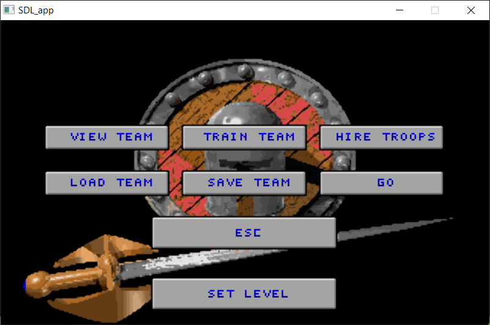
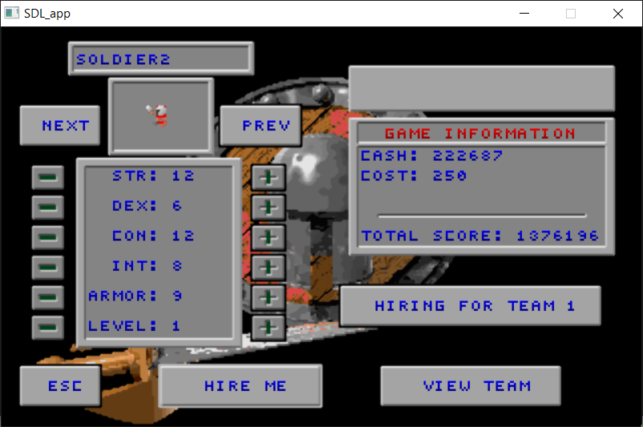
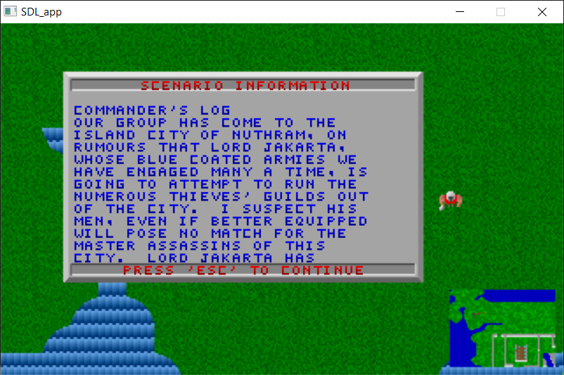

 

#  Openglad

Openglad is a port of the open-sourced dos game known as Gladiator
(http://fsgames.com/glad/). It is a top-view gauntlet style RPG that
features fast paced multiplayer action, several different classes, and
a scenario editor.

  

**Note:** as of July 1st, 2002, Gladiator is open sourced under the GPL.
The Forgotten Sages Development Team has graciously open sourced it,
and the developers of the Snowstorm team are sincerely thankful for
all the work that was saved.

*Thank you, FSGames.*

## For Developers

* **[Architecture](docs/ARCHITECTURE.md)** — Module structure, dependency rules, data flow, and build system
* **[Install / Build](docs/INSTALL.md)** — How to build from source (CMake, native, web)
* **[ncurses client](docs/ncurses-client.md)** — `openglad_curses`, a zero-SDL terminal (roguelike) client with the same menus, single-player, and host/join multiplayer

## Table of Contents

* [Install / Build](docs/INSTALL.md)
* [Playing](#Playing)
    * [Multiplayer setup](#multiplayer-setup)
* [Manual](https://openglad.org/manual)
* [Editing with Openscen](docs/scen.txt)
* [Cheats](docs/cheats.txt)
* [Gladiator ver. 3.8 manual & revision history](docs/glad.txt) (written by FSGames)

## Playing

The manual at [openglad.org/manual](https://openglad.org/manual) covers the
classes, controls, items, and scenarios. Pressing **F1** in a level opens the
in-game help, which is also readable as [glad.hlp](docs/glad.hlp).

### Multiplayer setup

Use **+** on Base Camp's **SEATS** rail to add local players. Open one of your
**P#** cards to choose that player's team and controls, or to remove the seat.
Put seats on the same team for co-op, or choose different teams for a versus
or mixed-team match. Use **<** and **>** when more than four seats are
connected. Seat count and team choices belong to the current session and are
not stored in a company save.

Player numbers are shared across the lobby. Your cards say **YOU**; cards
owned by another network client show its company abbreviation and are
read-only. Open **SCENARIO → VIEW LEVEL** for the complete seat and team
overview; the host's match settings sit on **SCENARIO** itself and
cross-control on **DIFFICULTY**. See
[Companies and Base Camp](docs/company-basecamp-design.md) for the full
multiplayer behavior.
