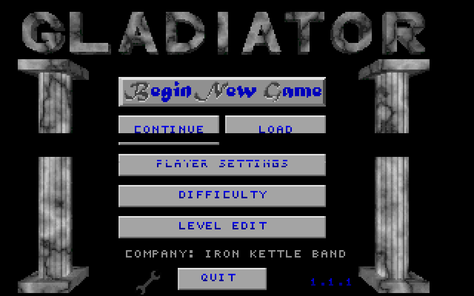
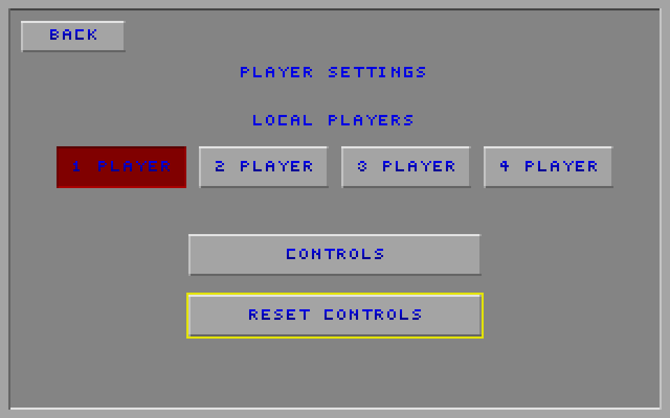
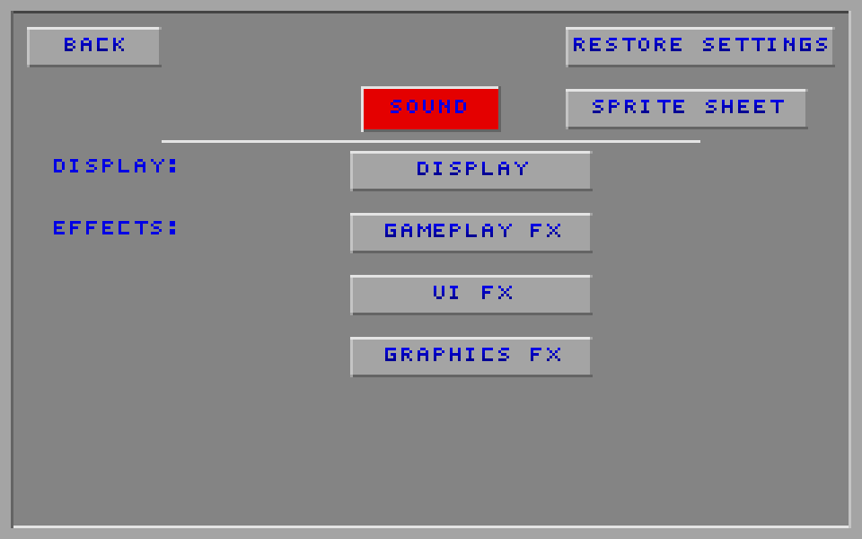
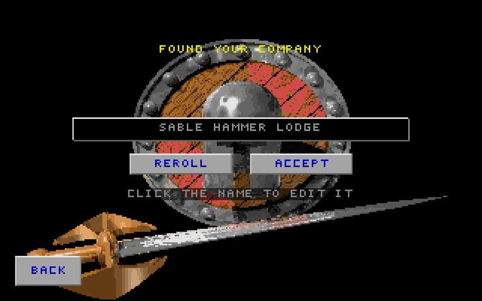
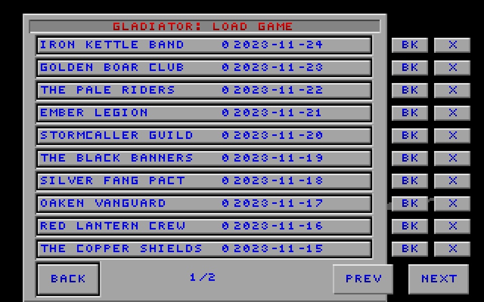
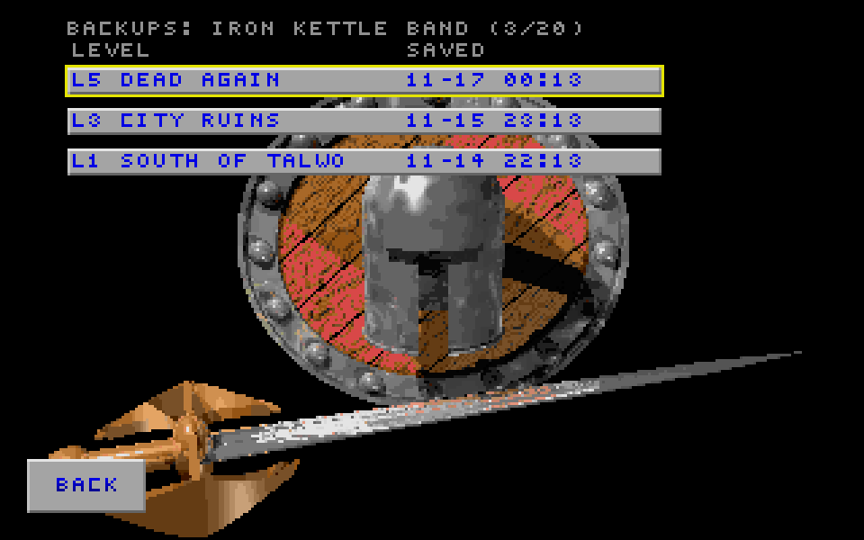
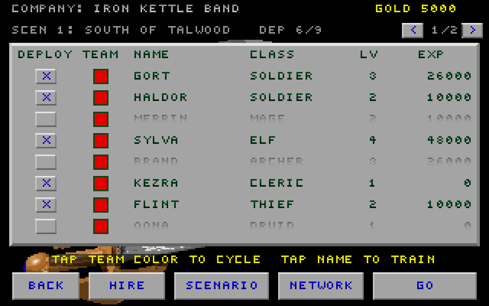
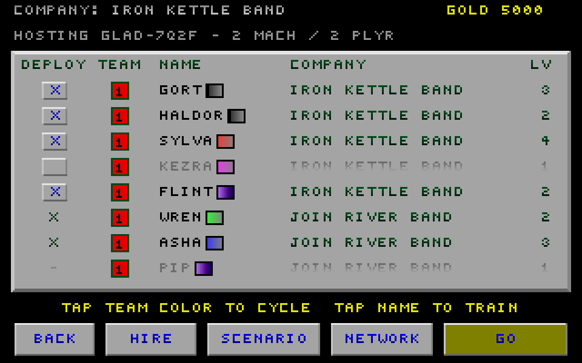
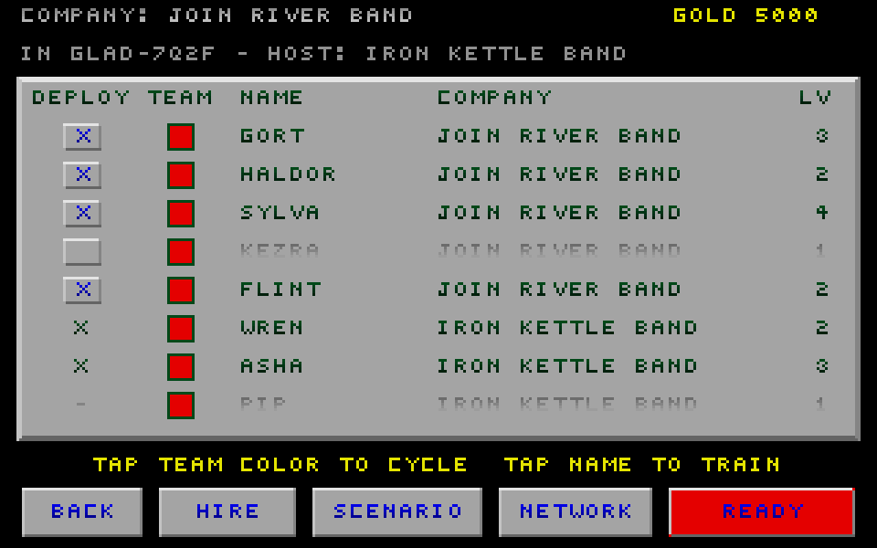

# Companies and Base Camp

This document describes the shipped company, Base Camp, and multiplayer-ready
behavior. It is the reference for save compatibility and cross-client
behavior.

## 1. Menu runtime

SDL picker screens are described by `MenuScreenSpec` and run through the shared
menu runtime. Text and curses clients project the same menu model into their own
interfaces. See [Menu runtime](menu-engine.md) for the frame contract and the
one deliberate exception: the SDL Networking screen.

## 2. Player experience

### 2.0 Shared conventions

- Buttons use the classic 320×200 menu canvas.
- Disabled actions remain visible and inert; hidden actions are removed from
  pointer and keyboard navigation.
- Destructive confirmations start on **No**.
- Company names are player-facing. Save-slot basenames stay internal.
- SDL, text, and curses clients expose the same company and roster operations.

### 2.1 Main menu

The main menu presents:

1. **Begin**
2. **Continue** and **Load**
3. **Level Editor**
4. **Players**, **Difficulty**, and **Game Settings**
5. **Help** and **Quit**

The web build keeps **Quit** visible but disabled. **Continue** opens the most
recent valid company; if no valid company exists, the player is sent to the
Company List.

| Player Settings | Game Settings |
|---|---|
|  |  |

### 2.2 Found Your Company

Beginning a new game opens a name-entry screen with the same editing grammar as
character naming. A generated fantasy name is offered initially and may be
rerolled or edited. The filename derived from that name is not shown.

### 2.3 Company List

**Load** opens a paged list ordered by last-played time. Each row has three
actions: open the company, inspect its backups, or delete it. Corrupt headers
remain visible as corrupt entries and cannot silently replace the active
company.

### 2.4 Backups

The backups view lists a company's snapshots newest first. Restoring rewinds
the selected company in place after making a pre-restore snapshot. Deleting a
company removes its backups as well. The active company cannot be deleted.

### 2.5 Base Camp

Base Camp replaces the old Team Build and View Team menus. The paged roster
shows eight characters with dedicated deploy, team, name, class or company,
level, and experience fields.

- Tap the deploy box to deploy or bench a character.
- Tap the team box to cycle the character's combat team.
- Tap the name or row body to train that character.
- Tap the scenario summary to open the Scenario menu.
- Network guests may inspect foreign rows but cannot mutate them.

### 2.6 GO and READY

Solo games show **GO**. In a network lobby, guests see **READY** and the host
sees **GO**. The host cannot start until every connected machine is ready and
the deployment can provide one distinct controllable hero for each local view.
Denials are shown instead of silently ignoring the request.

| Host | Joiner |
|---|---|
|  |  |

### 2.7 Cross-control

The host may allow players to control eligible characters owned by other
machines. Changing this session-only setting clears guest readiness. It does
not alter character colors or company ownership.

### 2.8 Follow mode

A network spectator, or a player whose controlled character is unavailable,
may follow an active hero. The HUD identifies the watched character and
company. Follow state is display-only and never changes ownership or combat
team.

## 3. Company storage

### 3.1 Save format v14

Company files retain the GTL layout and use version 14. Two formerly reserved
areas now carry:

- an eight-byte last-played Unix timestamp in the file header;
- a one-byte deployed flag in each roster entry.

The remaining bytes are zero-filled. Older fields and offsets are unchanged.
Version 13 readers can still traverse a v14 file because no tail was inserted
into the roster. Version 14 readers default older characters to deployed.

### 3.2 Slot names

The display name and storage basename are separate. A basename is normalized
to a safe virtual filename and probed for collisions, including collisions
after the ordinary numeric suffix range is exhausted.

### 3.3 Held-back characters

Benched characters never enter the mission object list. A win fold therefore
preserves them separately while rebuilding deployed survivors from the level.
Held-back characters have priority when the 24-character cap binds; new
recruits are dropped first. UI code must not retain roster indices across a
fold because the rebuilt roster may be reordered.

### 3.4 Active-company indirection

SDL and WebAssembly use a process-wide active-company slot selected by the
company UI. Text and curses clients retain their configured slot authority.
Network gameplay uses a transient combined-roster slot and never treats that
slot as a player's private company.

### 3.5 Header scans

Company and backup lists read only the fixed header. Scanning does not mount a
campaign or perform a full `SaveData::load`. Invalid headers are reported to
the UI without changing the current company.

### 3.6 Atomic writes

Company writes use a temporary file in the PhysFS write directory, close it,
and rename it over the destination. A failed write leaves the previous company
intact. Basenames are validated before any filesystem operation.

### 3.7 Snapshot backups

A successful level win creates a byte-for-byte snapshot before the company is
updated. Restore validates the chosen backup, snapshots the current company,
then replaces it atomically. Backup retention is bounded per company.

### 3.8 Autosave

Roster mutations autosave at their commit point: deploy, team change, hire,
training acceptance, rename, and promotion. Persisted match settings autosave
as well. In a lobby, a roster mutation republishes the roster and clears that
machine's ready state.

## 4. Multiplayer

### 4.1 Compatibility

Company/Base Camp multiplayer uses:

- lobby and gameplay protocol v8;
- world snapshot format v9;
- replay format v10.

Peers reject incompatible protocol versions during the handshake. Snapshot and
replay readers reject unsupported payload versions independently.

### 4.2 Roster assembly

Each machine advertises its complete roster once, including benched
characters. Mission assembly materializes only deployed entries. Ownership is
kept separately from combat team. A server-side 24-character reconciliation
may bench excess entries and sends the authoritative deployed flags back to
the owning client.

### 4.3 Ready state

Ready state belongs to a machine, not a character. Roster or relevant lobby
changes clear readiness. Empty-roster spectators may ready without supplying a
hero. Start validation checks all machines and returns a specific denial when
the roster cannot satisfy the requested local views.

### 4.4 Ownership and controls

`guy::teamnum` is combat allegiance. Player index and owner tags identify input
and persistence authority. Together/Split seat mode changes which team a view
drives; it never recolors a character. With cross-control disabled, input may
claim only eligible characters owned by that player or machine.

### 4.5 Follow and lobby changes

Follow targets are selected from the authoritative display world. Changing
cross-control or another start-relevant lobby setting clears guest readiness.
The first active authoritative team supplies the shared Together-mode control
team, including the spectator-host case.

### 4.6 Win shares

Mission winnings are split by each machine's share of the deployed roster.
The fold uses final authoritative totals and writes only the receiving
machine's private company. Opponents' roster progress and campaign history are
never copied into it.

### 4.7 Completion credit

Each machine preserves its private campaign history and adds only the level
that actually completed. Spectators advance to the session's next destination
without receiving roster, cash, score, or completion rewards they did not earn.

## 9. Stable interface decisions

The source and regression tests retain these section numbers as short
cross-references.

### 9.1 Centered labels

Button text is centered from its rendered ink width on every label surface.

### 9.2 Continue and Load

The Continue/Load pair occupies one full-width row. When no company exists, a
disabled explanatory row fills the same envelope without changing navigation
ordinals.

### 9.3 No filename preview

Name-entry screens show the company name only. Internal slug or `.gtl`
previews are intentionally absent on every client.

### 9.5 Base Camp columns

The roster sits on a padded grey panel. Names and classes use readable neutral
text; the old View Team family gradient survives in a separate swatch.
Maximum HP is omitted because class and level already determine it.

### 9.9 Numeric alignment

Small numeric fields are fixed-width and left-padded so their digits align
down the roster.

### 9.10 Header spacing

The company line, scenario/status line, help line, column header, and roster
have separate vertical bands.

### 9.11 Row-body training

The row body is the train action and the initial keyboard highlight. Foreign
network rows hide that action and use the wider ownership hit area instead.

### 9.12 Network status

The second header line shows host/join role, room, and machine/player census.
A degraded-link alert takes the same line and its warning color.

### 9.14 Eight-row page

Eight roster rows leave clear space around the instruction and column header.
The scenario summary is a direct click target.

### 9.19 Company List geometry

The Company List keeps the old Load Game frame and slot proportions while
placing open, backup, and delete actions on each row. Fewer rows per page keep
the frame centered and readable.

### 9.20 Shared input styling

Company naming uses the character-name input style. The Base Camp team value
and Train screen's **Playing on Team** setting are two views of the same field.

### 9.23 Team cycling

Cycling a team changes only the selected character and never re-sorts the
visible roster mid-click. The numbered team box carries combat color; the
separate family swatch preserves the classic class gradient.
