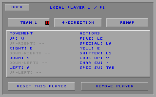
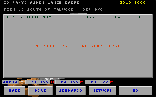

# Companies and Base Camp

This document describes the shipped company, Base Camp, and multiplayer-ready
behavior. It is the reference for save compatibility and cross-client
behavior.

## 1. Menu runtime

SDL picker screens are described by `MenuScreenSpec` and run through the shared
menu runtime. Text and curses clients project the same menu model into their own
interfaces. See [Menu runtime](menu-engine.md) for the frame contract and the
one deliberate exception: the SDL Networking screen.

## 2. Player experience

### 2.0 Shared conventions

- Buttons use the classic 320×200 menu canvas.
- Disabled actions remain visible and inert; hidden actions are removed from
  pointer and keyboard navigation.
- Destructive confirmations start on **No**.
- Company names are player-facing. Save-slot basenames stay internal.
- SDL, text, and curses clients expose the same company and roster operations.

### 2.1 Main menu

The main menu presents:

1. **Begin**
2. **Continue** and **Load**
3. **Level Editor**
4. **Game Settings**
5. **Cloud Saves**
6. **Help** and **Quit**

Difficulty is not here. It, respawns, permadeath and the rest describe the
fight a company is about to take, so their door lives on the Base Camp
command strip beside SCENARIO and GO (docs/camp-controls-design.md).

The web build keeps **Quit** visible but disabled. **Continue** opens the most
recent valid company; if no valid company exists, the player is sent to the
Company List.

The shared **CONTROLS** screen described here has since been deleted (see
[the pause-menu design](pause-menu-design.md)): direction mode, remap, reset
and input device are per-seat rows on the player screens — a Base Camp seat
card, or the pause menu's player rows in a mission. Seat count and next-level
team choices no longer live on the main menu.

### 2.2 Found Your Company

Beginning a new game opens a name-entry screen with the same editing grammar as
character naming. A generated fantasy name is offered initially and may be
rerolled or edited. The filename derived from that name is not shown.

### 2.3 Company List

**Load** opens a paged list ordered by last-played time. Each row has three
actions: open the company, inspect its backups, or delete it. Corrupt headers
remain visible as corrupt entries and cannot silently replace the active
company.

### 2.4 Backups

The backups view lists a company's snapshots newest first. Restoring rewinds
the selected company in place after making a pre-restore snapshot. Deleting a
company removes its backups as well. The active company cannot be deleted.

### 2.5 Base Camp

Base Camp replaces the old Team Build and View Team menus. The paged roster
shows eight characters with dedicated deploy, team, name, class or company,
level, and experience fields.

- Tap the deploy box to deploy or bench a character.
- Tap the team box to cycle the character's combat team.
- Tap the name or row body to train that character.
- The seat rail is **this machine's** four seats and nothing else. A slot with
  no seat in it is a button reading **ADD PLAYER**; tap it to claim that seat.
  A machine may contribute four active seats and a network lobby may contain
  sixteen. When the lobby is at its sixteen-seat ceiling the remaining slots
  dim and read **LOBBY FULL**.
- The rail shrinks to what the device can seat. A phone with no gamepad shows
  one card and nothing beside it; each gamepad attached to it adds one slot,
  up to four. An offer the hardware cannot accept is worse than no offer.
- Open a seat card to edit that player. The top row contains
  **4-DIRECTION**/**8-DIRECTION**, **REMAP**, and **RESET**. The bottom row
  contains **TEAM** and **REMOVE PLAYER**. In a network lobby the last action
  becomes **SPECTATE** when it removes the machine's final active seat. Tap
  any **ADD PLAYER** slot to return from spectator mode.
- Player numbers are lobby-wide, so a card can read **P5** on a machine that
  owns one seat. Other machines' seats are never in the rail: the header line
  counts them and **VIEW LEVEL** lists them by name and team.
- Multiple seats may deliberately choose the same team for co-op or team
  matchups. Seats on different teams oppose one another.
- The full seat and team overview lives in **VIEW LEVEL**, on the Scenario
  menu beside the level it describes.
- Tap the scenario summary to open the Scenario menu.
- Network guests may inspect foreign rows but cannot mutate them.

Adding or removing seats and choosing their teams changes the current session.
Those choices survive leaving Base Camp and returning through **CONTINUE**, but
they are neither loaded from nor written to a company file. Direction modes
and key bindings belong to the shared control configuration instead, so they
remain available across companies. Removing a seat moves its complete control
profile to the first unused local slot; adding a replacement seat therefore
reuses that profile instead of duplicating one of the surviving players'
bindings. Its factory-layout identity moves with it, so **RESET** and later
config reloads restore the same distinct layout.

### 2.6 GO and READY

Solo games show **GO**. In a network lobby, guests see **READY** and the host
sees **GO**. The host cannot start until every connected machine is ready and
the deployment can provide one distinct controllable hero for each local view.
Denials are shown instead of silently ignoring the request. Opening an owned
seat editor withdraws that machine's readiness before a synchronous remap or
confirmation can hold it there; the player must choose **READY** again.

| Host | Joiner |
|---|---|
|  |  |

### 2.7 Cross-control

The host may allow players to control eligible characters owned by other
machines from **DIFFICULTY**. Changing this session-only setting clears guest
readiness. It does not alter character colors or company ownership. Every
networked peer sees the setting; only the host may change it.

### 2.8 Follow mode

A network spectator, or a player whose controlled character is unavailable,
may follow an active hero. The HUD identifies the watched character and
company. Follow state is display-only and never changes ownership or combat
team.

## 3. Company storage

### 3.1 Save format v14

Company files retain the GTL layout and use version 14. Two formerly reserved
areas now carry:

- an eight-byte last-played Unix timestamp in the file header;
- a one-byte deployed flag in each roster entry.

The remaining bytes are zero-filled. Older fields and offsets are unchanged.
Version 13 readers can still traverse a v14 file because no tail was inserted
into the roster. Version 14 readers default older characters to deployed.

The historical player-count byte at offset 132 is retained only so older
readers can traverse the unchanged GTL layout. Writers put the canonical
single-player compatibility value there, while current readers ignore valid
legacy values. The live local player count and per-seat team choices are
session state and do not belong to a company.

### 3.2 Slot names

The display name and storage basename are separate. A basename is normalized
to a safe virtual filename and probed for collisions, including collisions
after the ordinary numeric suffix range is exhausted.

### 3.3 Held-back characters

Benched characters never enter the mission object list. A win fold therefore
preserves them separately while rebuilding deployed survivors from the level.
Held-back characters have priority when the 24-character cap binds; new
recruits are dropped first. UI code must not retain roster indices across a
fold because the rebuilt roster may be reordered.

### 3.4 Active-company indirection

SDL and WebAssembly use a process-wide active-company slot selected by the
company UI. Text and curses clients retain their configured slot authority.
Network gameplay uses a transient combined-roster slot and never treats that
slot as a player's private company.

### 3.5 Header scans

Company and backup lists read only the fixed header. Scanning does not mount a
campaign or perform a full `SaveData::load`. Invalid headers are reported to
the UI without changing the current company.

### 3.6 Atomic writes

Company writes use a temporary file in the PhysFS write directory, close it,
and rename it over the destination. A failed write leaves the previous company
intact. Basenames are validated before any filesystem operation.

### 3.7 Snapshot backups

A successful level win creates a byte-for-byte snapshot before the company is
updated. Restore validates the chosen backup, snapshots the current company,
then replaces it atomically. Backup retention is bounded per company.

### 3.8 Autosave

Roster mutations autosave at their commit point: deploy, team change, hire,
training acceptance, rename, and promotion. Persisted match settings autosave
as well. In a lobby, a roster mutation republishes the roster and clears that
machine's ready state. Adding, removing, and assigning player seats, as well as
cross-control, remain session state: they are synchronized through the lobby
but are not written into a private company roster. Direction modes and keymaps
are saved in the process-wide control configuration, not in a company.

## 4. Multiplayer

### 4.1 Compatibility

Company/Base Camp multiplayer uses:

- lobby and gameplay protocol v9;
- world snapshot format v9;
- replay format v11.

Peers reject incompatible protocol versions during the handshake. Snapshot and
replay readers reject unsupported payload versions independently.

### 4.2 Roster assembly

Each machine advertises its complete roster once, including benched
characters. Mission assembly materializes only deployed entries. Ownership is
kept separately from combat team. A server-side 24-character reconciliation
may bench excess entries and sends the authoritative deployed flags back to
the owning client.

### 4.3 Ready state

Ready state belongs to a machine, not a character. Roster or relevant lobby
changes clear readiness. A client with an active seat but an empty roster may
ready without supplying a hero. A machine with no active seat remains
connected as a spectator, has no **READY** action, and does not consume player
capacity or a gameplay binding; any **ADD PLAYER** slot reactivates its dormant
stable seat token. Start validation checks participating machines and returns a specific
denial when the roster cannot satisfy the requested local views.

### 4.4 Ownership and controls

`guy::teamnum` is combat allegiance. Player index and owner tags identify input
and persistence authority. A Base Camp seat card assigns that player and view
to a team for the next level; several seats may intentionally share one team.
Changing a seat assignment never recolors a character. With cross-control
disabled, input may claim only eligible characters owned by that player or
machine.

The seat rail shows only the seats this machine owns, in local-slot order, so
slot **k** of the rail is always local controller profile **k**. The visible
`P#` on that card is a dense lobby-wide display ordinal and may change when a
seat or machine leaves. Team-change and remove commands therefore target a
separate stable, server-issued seat token. Removing a middle seat re-densifies
the display ordinals without changing its siblings' tokens. The server also
assigns every connected machine an identity shared by all of its seats;
readiness and census grouping use that identity instead of matching mutable
display names. Each lobby-state echo also carries a recipient-specific list of
owned seat tokens, so **YOU**, edit rights, and runtime bindings never depend
on a player or company name being unique.

### 4.5 Follow and lobby changes

Follow targets are selected from the authoritative display world. Adding or
removing a seat, changing a player-seat assignment, changing cross-control, or
editing another start-relevant lobby setting clears guest readiness. At match
start, each global player index uses its authoritative seat assignment rather
than deriving a shared control team from another player.

### 4.6 Win shares

Mission winnings are split by each machine's share of the deployed roster.
The fold uses final authoritative totals and writes only the receiving
machine's private company. Opponents' roster progress and campaign history are
never copied into it.

### 4.7 Completion credit

Each machine preserves its private campaign history and adds only the level
that actually completed. Spectators advance to the session's next destination
without receiving roster, cash, score, or completion rewards they did not earn.

## 9. Stable interface decisions

The source and regression tests retain these section numbers as short
cross-references.

### 9.1 Centered labels

Button text is centered from its rendered ink width on every label surface.

### 9.2 Continue and Load

The Continue/Load pair occupies one full-width row. When no company exists, a
disabled explanatory row fills the same envelope without changing navigation
ordinals.

### 9.3 No filename preview

Name-entry screens show the company name only. Internal slug or `.gtl`
previews are intentionally absent on every client.

### 9.5 Base Camp columns

The roster sits on a padded grey panel. Names and classes use readable neutral
text; the old View Team family gradient survives in a separate swatch.
Maximum HP is omitted because class and level already determine it.

### 9.9 Numeric alignment

Small numeric fields are fixed-width and left-padded so their digits align
down the roster.

### 9.10 Header spacing

The company line, scenario/status line, column header, roster, player-seat
rail, and command strip have separate vertical bands.

### 9.11 Row-body training

The row body is the train action and the initial keyboard highlight. Foreign
network rows hide that action and use the wider ownership hit area instead.

### 9.12 Network status

The second header line shows host/join role, room, and the census — **players
first**, then machines, because the seat rail shows only this machine's seats
and the size of the lobby has nowhere else to live. It reads
`HOSTING GLAD-7Q2F: 3 PLAYERS / 2 MACHINES` (or `IN <room>: ...` for a guest).
A narrower band takes a whole shorter spelling rather than a byte cut:
`3 PLAYERS/2 PCS`, then `3P/2M`, then the room code goes. One is one: a lobby
of one reads `1 PLAYER`, `1 MACHINE`, `1 PC` — the singular is always the
shorter spelling, so it can never cost a rung the band it used to fit. The
joiner's line
no longer names the host company — every one of the host's roster rows already
does, and none of them carries the census. A degraded-link alert takes the
same line and its warning color.

### 9.14 Eight-row page and the seat rail

Eight roster rows fit above the independent player-seat rail while leaving the
column header clear. The scenario summary is a direct click target.

The rail is four slots on a **fixed** grid: 70-pixel faces at x = 8, 86, 164
and 242, an 8-pixel gutter between them, opening on BACK's left edge and
closing on the panel's right rail with no remainder (4x70 + 3x8 = 304 = 312 -
8). Slot **k** is at 8 + 78k whether or not its neighbours are on screen, so a
card can never slide sideways under a finger already on its way down to it.
The face never changes width; it is an eleven-character label budget that the
seat names, **ADD PLAYER**, **LOBBY FULL** and the team chip all depend on.
The chip owns the face's last ten pixels — eight for the chip and one of face
either side of it, so it is framed on the right exactly as it is above and
below — and a seat label's two trailing pads are what centre its ink over the
zone the chip leaves rather than over the whole face. A bare slot has no chip
to dodge, so **ADD PLAYER** and **LOBBY FULL** centre on the face itself.

The rail's band — everything between the roster panel's bottom bevel and the
command strip — is painted black before the buttons draw. The title backdrop
runs behind this screen, and the 8-pixel gutters framed a fragment of its grey
blade so neatly that it read as a stray glyph between two cards. One ground
under the whole row also makes a networked frame and a local one identical
here. The band is 17 pixels for a 10-pixel card: 3 above and 4 below, because
an odd budget cannot split evenly and the heavier gap belongs under the rail,
where the command strip's own bevel already separates.

A dimmed slot is still a whole card. The disabled face shade collides with the
button shadow shade, so a dimmed face steps its right and bottom bevels one
shade darker; without that, **LOBBY FULL** rendered as a card with a flat
right edge.

What varies is how many slots are live, and that is a property of the DEVICE,
never of the lobby: four on a desktop, one on a phone with nothing attached,
one more per gamepad. A slot past the device cap is absent. A slot inside it
with no seat in it is a real button reading **ADD PLAYER** whose activation is
the add path itself — the same debounce, the same capacity gates, the same
gamepad auto-claim. When the lobby is at its sixteen-seat ceiling that button
dims and reads **LOBBY FULL** instead: the seat is still this machine's to
offer, and the reason it cannot be taken is somewhere else.

The rail once windowed the whole lobby. It opened with a **SEATS** label that
led to the team overview — a second, worse-placed door to a screen the
Scenario menu already owned — and it cost the cards their breathing room, the
four faces sitting a single pixel apart. Issue #236 spent the label's width on
the gutters and gave its ordinal to a **+** at the left end; issue #243
stopped the leftover width from collecting in the holes hidden controls left
behind, drawing empty recesses (ghosts) where a seat could still land. Both
were fixes to a premise that was wrong: remote seats were in the rail, which
forced a pager, which forced a moving grid, which forced the **+** to live
somewhere the cards were not. Restricting the rail to this machine's seats
retires the **+**, both pagers and the ghosts at once — the ghost became the
button it was always miming, and remote seats moved to the two places that
already described them, the header line's census and **VIEW LEVEL**'s seat
report.

### 9.19 Company List geometry

The Company List keeps the old Load Game frame and slot proportions while
placing open, backup, and delete actions on each row. Fewer rows per page keep
the frame centered and readable.

### 9.20 Shared input styling

Company naming uses the character-name input style. The Base Camp team value
and Train screen's **Playing on Team** setting are two views of the same field.

### 9.23 Team cycling

Cycling a team changes only the selected character and never re-sorts the
visible roster mid-click. The numbered team box carries combat color; the
separate family swatch preserves the classic class gradient.
