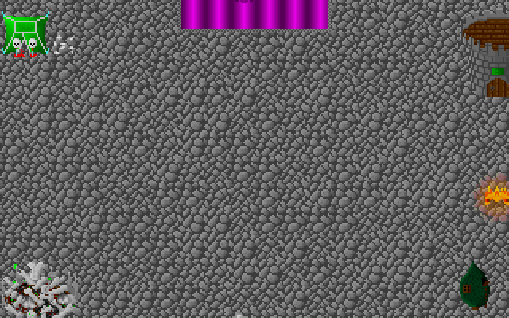
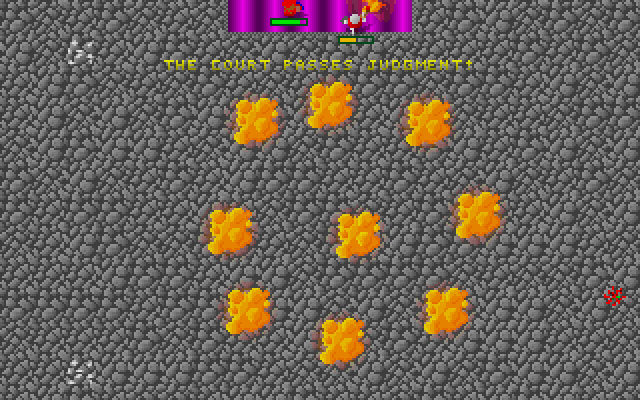
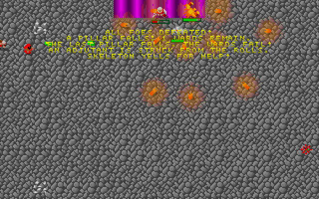
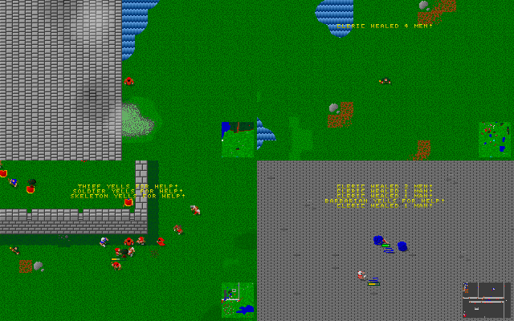

# Class-pack media

Captures of the Lua class-pack work, taken from real AI-driven gameplay. Every
file here is produced headlessly — SDL's dummy video driver, software renderer,
no display — by `scripts/media/capture_showcase.sh`, which encodes the captured
frames with ffmpeg from the dev shell:

```bash
cmake --build --preset ci-test --target openglad_demo
nix develop --command scripts/media/capture_showcase.sh
```

The two capture runs are seeded (`OPENGLAD_DEMO_SEED=7` and `=5`), so re-running
the script reproduces every file below byte for byte. That is also why the
script can name specific frame numbers: frame 301 is the judgment pulse in
*every* run of that seed.

## The Ninefold Court

Scenario 605 of `org.openglad.concept`, whose fight logic is a Lua level script
shipped inside the campaign package
(`packs/org.openglad.concept.showcase/scripts/court.lua`, source in
`tools/concept_mapgen/showcase_pack.cpp`). The camera is pinned to the middle
of the arena; the six heroes and everything they fight are AI-driven.

| File | What it shows |
| --- | --- |
| `ninefold-court.gif` | The whole fight at ~4x speed: four corner pillars warding the Magistrate, the pillars falling one by one, and the first judgment pulse once the wards break. 60 frames over 8.04s, 640x400. |
| `ninefold-court-judgment.gif` | One judgment pulse tick for tick — nine explosions laid out on a ring around the arena centre, thrown by `judgment_pulse()`. 43 frames over 4.0s, 640x400. |
| `ninefold-court-pillars.png` | The four colleges standing in the corners (tent, tower, bones, treehouse) as the first ward drops: *"A pillar falls: 3 wards remain."* |
| `ninefold-court-wards-fail.png` | Three script messages at once: *"The last pillar falls. The wards fail!"*, *"An Adjutant is struck from the rolls."*, and the stock `SKELETON YELLS FOR HELP!` from the Lua skeleton family. |
| `ninefold-court-judgment.png` | The ninefold ring at full bloom under *"The Court passes judgment!"* |
| `ninefold-court-judgment.bmp` | The same frame exactly as the game wrote it: an 8-bit indexed BMP at the native 320x200. Everything else here is the 2x nearest-neighbour upscale that makes the 4x6 font legible. |

The explosions are only on screen for three simulation frames, a quarter of a
second, so both animations hold those three frames longer — a longer per-frame
delay on the same picture, since GIF stores every frame's delay natively.
Nothing else is retimed.

Each moment in those images comes from a different hook: `on_load` stamps the
ward, `on_entity_death` counts the pillars down and drops it, `on_tick` fires
the ring every 300 ticks, and the generator `customize_spawn` hook is what turns
a plain spawn into an Adjutant.







## Everything else is a class pack too

| File | What it shows |
| --- | --- |
| `demo-grid.png` | Four stock campaign levels (2, 5, 8, 13) simulating at once in one composited 2x2 grid. |

The messages in that grid are the point: *cleric healed 4 men*, *thief yells for
help*, *defending while escaping*. Those are family behaviours, and each of them
now dispatches through a Lua class pack rather than a C++ family callback.



The same claim in machine-readable form, via the headless text client:

```bash
printf 'tick 320\ncensus\nquit\n' | build/ci-test/openglad_text --protocol \
    --campaign org.openglad.concept --level 605 \
    --team 0,1,2,3,4,5 --team-level 8 --seed 7
```

```json
{
  "cmd": "census", "tick": 320, "team_counts": [6, 1, 0, 0, 0, 0, 0, 0],
  "named": [
    { "name": "Magistrate", "team": 1, "hp": 708, "dead": false },
    { "name": "Adjutant",   "team": 1, "hp": -1,  "dead": true  },
    { "name": "Phantom",    "team": 1, "hp": -20, "dead": true  }
  ]
}
```

`Adjutant` is not in any level file. The name, the extra three levels, the speed
bonus and the 1.5x hit points are all stamped by the pack's `customize_spawn`
hook on every third generator spawn.

## How the capture works

`openglad_demo` gained a set of opt-in environment knobs; with all of them unset
it behaves exactly as before (`scripts/test_demo_smoke.sh` pins that).

| Variable | Effect |
| --- | --- |
| `OPENGLAD_DEMO_CAMPAIGN` | Campaign id to load (default `org.openglad.gladiator`). |
| `OPENGLAD_DEMO_SCENARIOS` | Comma-separated scenario ids, assigned to grid cells in order, instead of the shuffled demo pool. |
| `OPENGLAD_DEMO_TEAM_SIZE` | Fixed player roster size instead of one hero per living enemy. |
| `OPENGLAD_DEMO_CAPTURE_DIR` | Where to dump frames. Unset ⇒ no capture at all. |
| `OPENGLAD_DEMO_CAPTURE_EVERY` | Dump every Nth rendered frame (default 1). |
| `OPENGLAD_DEMO_CAPTURE_START` / `_LIMIT` | Skip the first N frames / stop after N dumps. |
| `OPENGLAD_DEMO_CAPTURE_SESSION` | Which grid cell to dump; `-1` dumps the composited grid. |
| `OPENGLAD_DEMO_CAPTURE_FOCUS` | `player` (the demo's follow camera), `boss`, or `center`. |

Frames land as 8-bit indexed BMPs: the game renders into a 32bpp canvas, but
every pixel it plots comes from the 256-entry session palette, so the capture
maps them back to the indices they came from. From there ffmpeg (provided by
`nix develop`, see `flake.nix`) does all the encoding. Each animation is cut
with the concat demuxer — one list line per frame with an explicit duration —
and encoded through the two-pass `palettegen`/`paletteuse` chain with no
dithering: the frames use at most 256 colours, so the palette is exact and
every pixel maps 1:1. ffmpeg's GIF encoder stores only each frame's changed
region, which is what keeps a 640x400 animation at a few hundred KB instead of
2.5 MB. The stills go through the same palette pass so the PNGs stay indexed
(`pal8`) rather than ballooning to 32-bit RGB.

To check the results are intact:

```bash
python3 scripts/media/verify_media.py   # ffprobe-decodes every file: codec,
                                        # size, frame count, duration, pal8
```
